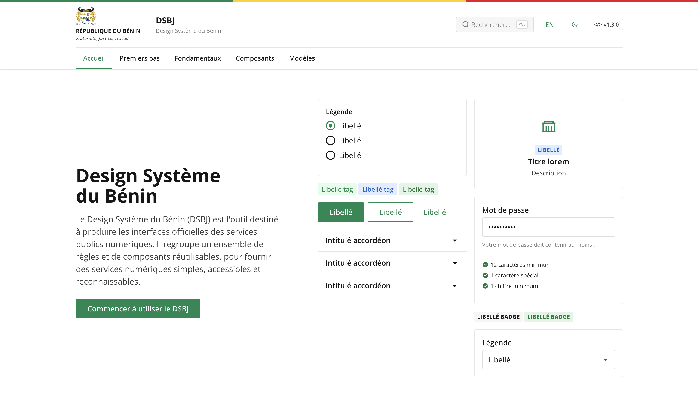

<p align="center">
  
</p>

<p align="center">
  <a href="https://www.npmjs.com/package/@flrxnt/dsbj"></a>
  <a href="https://opensource.org/licenses/MIT"></a>
  
</p>

# DSBJ - Design Système du Bénin

Le **Design Système du Bénin (DSBJ)** est l'outil destiné à produire les interfaces officielles des services publics numériques. Il regroupe un ensemble de règles et de composants réutilisables pour fournir des services numériques simples, accessibles et reconnaissables.

> Construit avec SCSS · TypeScript · Vite · Vitest

---

## Installation

```bash
bun add @flrxnt/dsbj
```

### Import ES Module

```js
import '@flrxnt/dsbj';
```

Le module importe automatiquement les styles CSS et initialise les composants JavaScript au chargement du DOM.

### Import CSS seul

```html
<link rel="stylesheet" href="node_modules/@flrxnt/dsbj/dist/dsbj.css">
```

Ou via le point d'export :

```js
import '@flrxnt/dsbj/css';
```

### Import SCSS (personnalisation avancée)

```scss
@use '@flrxnt/dsbj/scss' as *;
```

### CDN

```html
<link rel="stylesheet" href="https://unpkg.com/@flrxnt/dsbj@1.1.0/dist/dsbj.css">
<script src="https://unpkg.com/@flrxnt/dsbj@1.1.0/dist/dsbj.umd.js"></script>
```

## Développement

```bash
# Installer les dépendances
bun install

# Serveur de développement (documentation avec hot-reload)
bun run dev

# Build de la bibliothèque (dist/)
bun run build

# Tests
bun run test

# Tests en mode watch
bun run test:watch
```

## Structure du projet

```
dsbj/
├── src/
│   ├── index.ts              # Point d'entrée (import SCSS + export JS)
│   ├── dsbj.scss             # Point d'entrée SCSS
│   ├── core/                 # Fondamentaux (reset, couleurs, typographie, grille, espacement)
│   ├── component/            # 35 composants SCSS
│   ├── utility/              # Classes utilitaires
│   └── js/                   # Modules TypeScript (accordion, modal, tab, header, etc.)
├── tests/                    # Tests Vitest (8 fichiers, 23 tests)
├── docs/                     # Documentation complète
│   ├── index.html            # Page d'accueil
│   ├── docs.css              # Styles du site de documentation
│   ├── premiers-pas/         # Installation, utilisation
│   ├── fondamentaux/         # Couleurs, typographie, grille, espacement, icônes...
│   ├── composants/           # 35 fiches composants
│   └── modeles/              # Templates de pages types
├── dist/                     # Build (CSS + JS ES + JS UMD)
├── vite.config.ts            # Build library
├── vite.docs.config.ts       # Serveur de dev documentation
├── vitest.config.ts          # Configuration des tests
├── tsconfig.json             # TypeScript
└── package.json
```

## Build output

| Fichier | Taille | Description |
|---------|--------|-------------|
| `dist/dsbj.css` | ~78 Ko | Styles complets |
| `dist/dsbj.es.js` | ~7 Ko | Module ES |
| `dist/dsbj.umd.js` | ~6 Ko | Module UMD |

## Préfixe CSS

Toutes les classes utilisent le préfixe `bj-` et les variables CSS `--bj-*`.

## Thème sombre

```html
<html data-bj-theme="dark">
```

Le thème sombre s'active automatiquement avec `prefers-color-scheme: dark` ou manuellement via l'attribut `data-bj-theme`.

## Accessibilité

- Conforme WCAG 2.1 niveau AA
- Navigation clavier complète
- Attributs ARIA sur tous les composants interactifs
- Focus visible avec `focus-visible`
- Skip links intégrés

## Licence

MIT - République du Bénin
